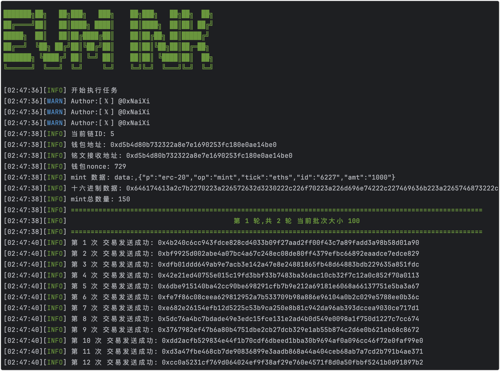

# evm_ink_rs :evm系列通用打铭文工具 

# 展示


测试地址
https://goerli.etherscan.io/tx/0xa7d4962386b3813596fefb81e16fe8eaec21f1589ebd0b573bf6757b118cfdf5
# 使用方法
1,下载本项目,自行编译或者运行别人编译好的版本
```
# 如果安装过rust 可以输入命令(务必设置好.env文件内容)
cargo run --release
```
2,自行设置.env文件内容

3,运行

# 使用详情说明
1. **rpc设置 `必填`:**  rpc 需要支持 batchRequest 一般都会支持 

主网: https://rpc.ankr.com/eth  holesky测试网: https://ethereum-goerli.publicnode.com
```
rpc_url=https://ethereum-goerli.publicnode.com
```

2. **你的私钥`必填`:** 带不带0x前缀都可以
```
private_key=b959811d951cfa75a5af5560db81d4a651535206d86fda54df02a6eece90d2b0
```
3. **接收地址 `选填`:** 带0x前缀,可不填 不填默认为私钥对应的钱包地址
```
#to_address=
```
4. **最大 gas 费用 `必填`:** 这个值一定要大于 gas 优先费用
```
max_fee_per_gas=130
```
5. **gas 优先费用(小费) `选填`:** 如果当前链 不支持小费模式(EIP1559 比如 bsc) 这个值可以不填
```
max_priority_fee_per_gas=1
```
6. **mint 的数量 `必填`:** 如果包含id 范围数据 会取 count 和 id 范围的最小值
```
count=1
```
7. **mint 的数据 `必填`:** 直接复制铭文文本，或十六进制（必须0x开头）复杂数据看下方说明

```
data='{"p":"erc-20","op":"mint","tick":"eths","id":"6227","amt":"1000"}'
或
data=0x646174613a2c7b2270223a226572632d3230222c226f70223a226d696e74222c227469636b223a2265746873222c226964223a2236323237222c22616d74223a2231303030227d
```

8. **prefix `选填`:** 正常不需要设置和修改 除非 是 新出的各种 铭文协议 常规铭文 不懂不要设置
```
#prefix=data:,
```

9. **gas_limit `选填`:** 正常不需要设置和修改 默认为 50000 但是由于个别项目 或者 个别链  50000 可能不够用 可以设置
```
#gas_limit=260000
```

# mint 的数据详细说明
**【注意】**

**如果是 json 文本格式(如 {"p":"erc-20","op":"mint","tick":"pi","amt":"1000"}) 
前后一定要加一个 单引号(`'`)** 

**注意 双引号(`"`) 具体包裹的数据 注意 数据究竟带不带双引号**

下方都是正确的例子 和 解释
1. 你要 mint 的 数据，十六进制格式(0x开头的数据) 和 文本格式(json 格式 前后需要加两个单引号) 都可以填
```
data='{"p":"erc-20","op":"mint","tick":"eths","id":"6227","amt":"1000"}'
```

2. 如果 json 数据中 有 需要改成当前地址的地方 使用 [address] 代替(注意前后的单引号) 下方是正确例子
```
data='{"p":"erc-20","op":"mint","tick":"eths","id":"6227","to":"[address]","amt":"1000"}'
```
3. 如果 json 数据中 有 需要更改序号的地方 使用 [start-end] 代替(注意前后的单引号)

下方是三种情况 下方是正确例子

(1) 下方是 id 从 1000 到 2000 的情况 具体数值需要自己设置  可以范围大一点 mint 数量会取 范围 和 上方 count 的最小值
```
data='{"p":"erc-20","op":"mint","tick":"eths","id":"[1000-1100]","amt":"1000"}'
data='{"p":"erc-20","op":"mint","tick":"eths","id":"[1000-2000]","to":"[address]","amt":"1000"}'
data='{"p":"erc-20","op":"mint","tick":"eths","id":"[1000-1001]","to":"[address]","amt":"1000"}'
```
(2) 下方是 id 到 2000 结尾 的情况 程序会自动 从 2000 递减, 直到发出 上方设置 count 数量的交易, 也就是说如果 count 设置为 3 那么会发出 2000, 1999, 1998 三笔交易 具体数值 自己设置
```
data='{"p":"erc-20","op":"mint","tick":"eths","id":"[-2000]","to":"[address]","amt":"1000"}'
```
(3) 下方是 id 从 1000 开始 的情况 程序会自动 从 1000 递增, 直到发出 上方设置 count 数量的交易, 也就是说如果 count 设置为 3 那么会发出 1000, 1001, 1002 三笔交易 具体数值 自己设置
```
data='{"p":"erc-20","op":"mint","tick":"eths","id":"[1000-]","to":"[address]","amt":"1000"}'
```


# 提示
1. 先1张测试成功后再加数量, 或者使用其他gas低的链rpc先测试使用
2. 软件未经过大量测试, 请谨慎使用, 请自行测试
3. 不懂的看说明解释, 有问题可以留言
4. 全自动亏钱 关注 @0xNaiXi
5. 恭喜发财
6. 合作联系推特 @0xNaiXi
7. 有时候由于 卡链 发出去的交易 一直卡再 交易池 不会被执行  多跑几次就行了


# 说明
1. 只是学习rust的练手项目(代码搬运工)，代码比较烂，有更优者可以提pr 或 留言你的项目地址

## TODO

1. [x] 加入多账号支持
2. [x] 加入value设置
3. [x] 加入自定义设置批量交易的数量
4. [x] 加入自定义设置批量交易的间隔时间
5. [ ] 加入http 和 ws 两种rpc支持 !!!似乎需要!!!
6. [ ] 多账号使用多线程执行 !!!未确定是否需要!!!
